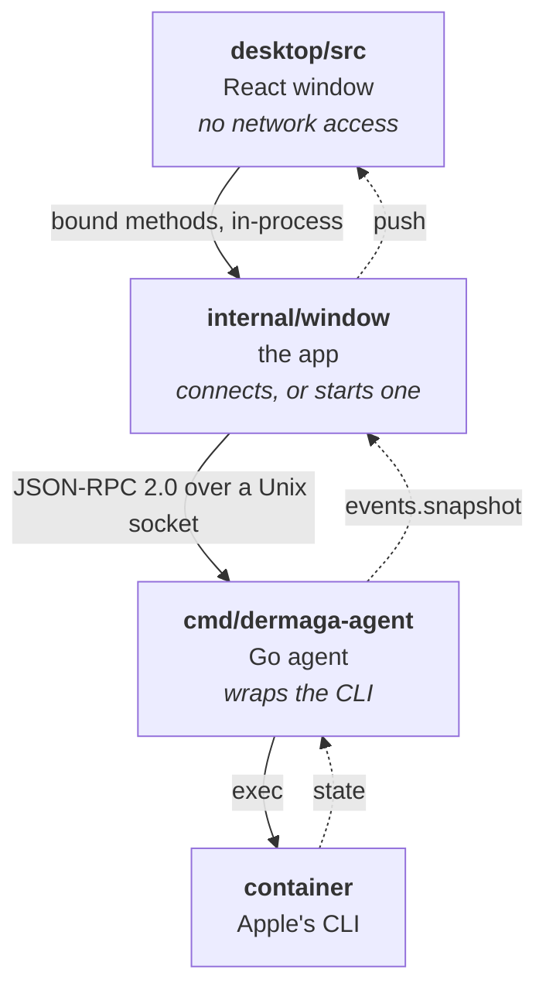
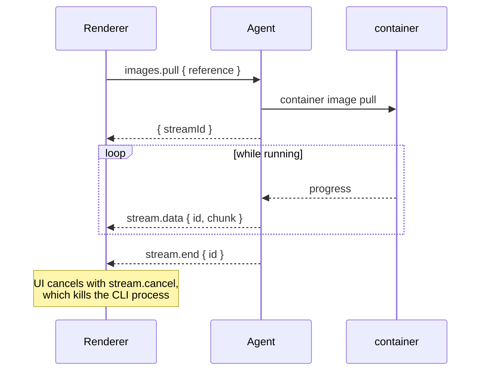

<p align="center">
  
</p>

<h1 align="center">Dermaga</h1>

<p align="center">
  A native macOS UI for Apple's <a href="https://github.com/apple/container"><code>container</code></a> runtime.<br>
  Manage containers, images, volumes, networks and machines without leaving the keyboard.
</p>

<p align="center">
  
  
  
</p>

---

Dermaga is a lightweight alternative to Docker Desktop for Apple Silicon. A small Go agent wraps the
`container` CLI and the UI subscribes to it, so everything you do is immediately visible to
`container ls` and vice versa. It opens no ports: the agent and the app speak over a socket in your
own home directory.

No daemon by default — the agent belongs to the app and goes when it does. There is one if you want
one: a per-user background service you switch on in Settings, which keeps watching your containers,
and restarting the ones you asked it to, while Dermaga is closed.

## Features

- **Containers** — create, start, stop, restart, edit and remove; multi-select for bulk actions. Per
  container: live CPU and memory, IPv4/IPv6, gateway, MAC, MTU, DNS, mounts, environment,
  capabilities and runtime flags, plus the last half hour of CPU and memory as a chart. Published
  ports open in your browser.
- **Terminal** — a real shell in any running container or machine, backed by a pty, with a prompt,
  line editing, colours and resize. Open it as the image's own user, as root, or as anyone else.
- **Logs** — follow container, machine and service logs, with filtering and follow-on-scroll.
- **Images** — build from a Dockerfile with live progress, pull, inspect layers, build history and
  the config a container inherits. Tags sharing a digest are shown as one image. Save one out as an
  OCI archive, or load an archive back in.
- **Files** — browse a container's filesystem, drag files and folders in from Finder, and drag them
  back out again.
- **Registries** — sign in to a registry, tag an image and push it. Credentials go to Apple's CLI on
  stdin and are never held here.
- **Vulnerabilities** — every image is scanned in the background and the counts appear beside it in
  the list. Per image: the CVEs, the package each one is in, and the version that fixes it. Runs
  entirely on your Mac; nothing about your images is sent anywhere.
- **Networks** — create and delete, and open one to see it drawn: the network in the middle, every
  container attached to it around the edge with the address it holds there, and the gateway as a
  node of its own. Attach an existing container to a network, or detach it, from the network's page
  or the palette.
- **Volumes** — create and delete, see which containers mount one and where it lands inside each,
  and read what it actually costs on disk rather than the half-terabyte cap it was created with.
  Open one and look inside it, even when no container has it mounted.
- **Containers that start with Dermaga** — mark one and it comes up when the agent does: when you
  open the app, or at login with the background service on. Apple's CLI has nothing like it.
- **Machines** — create, boot, stop, resize (CPU, memory, home mount) and delete the Linux VMs.
- **System** — start and stop the background services, read their logs, and reclaim disk space.
- **Speaks up** — a container that stops without being asked to is reported: in the window, as a
  sound when the window is not what you are looking at, and as a notification.
- **Command palette** — `⌘K` finds any container, image, volume, network, machine or page by name,
  starts or stops a container without hunting for its row, runs a container from an image, attaches
  or detaches one from a network, and opens the create, pull, build and load forms directly.
- **Live by default** — no refresh button anywhere. Changes made in a terminal appear within two
  seconds; changes made in Dermaga appear immediately.
- **Updates itself** — when a newer release exists the status bar says so; one click downloads it,
  opens the installer and stands aside.

## Install

Download the DMG from [Releases](https://github.com/ryanbekhen/dermaga/releases), open it and drag
Dermaga to Applications. The agent is inside the bundle — there is nothing else to install and no
separate service to run.

> **First open:** macOS will say it *"could not verify Dermaga is free of malware"*. Releases are not
> yet notarized by Apple, so Gatekeeper blocks them by default. Try to open the app, then go to
> **System Settings → Privacy & Security** and click **Open Anyway**. You only do this once.
> (The old right-click → **Open** shortcut no longer works on macOS 15 and later.)

To build it yourself:

```bash
git clone https://github.com/ryanbekhen/dermaga.git
cd dermaga
make desktop-deps
make dist          # → dist/Dermaga-<version>-arm64.dmg
make install       # or build and copy straight to /Applications
```

`make dist` refuses to produce a DMG that is missing the agent, the icon or a valid signature, so a
build either works on someone else's Mac or fails on yours.

**Requirements:** macOS 12+ on Apple Silicon and [Homebrew](https://brew.sh). Building from source
also needs Go 1.26+ and Node 18+.

You do not need to install Apple's `container` CLI yourself. On first launch Dermaga checks for it
and installs it through Homebrew, then starts the background services — see below.

## First launch

The splash screen is a bootstrap, not a progress bar. It runs five checks and fixes what it can:

1. **Starting the agent** — the Go process behind the app
2. **Checking Homebrew** — if it is missing, Dermaga explains why it is needed and closes, because
   nothing further can succeed
3. **Checking the container CLI** — installs it with `brew install container` if absent, showing the
   live progress
4. **Checking container services** — starts them, and installs the default Linux kernel if this Mac
   has none
5. **Loading your containers**

Anything it cannot fix is reported there rather than dropped into an empty window.

The kernel deserves a note: the services start perfectly well without one, and the failure only
surfaces later as *"default kernel not configured for architecture arm64"* when something tries to
run. Dermaga asks directly instead of waiting to be told, and installs it — 569 MB from GitHub, so
on a slow line it takes a while. The splash waits as long as the download keeps moving; if it stops
entirely the window opens anyway and the status bar keeps the reminder, with the command to run by
hand.

The vulnerability scanner sets itself up separately, in the background: Trivy through Homebrew, then
its database. That never holds up the window — you can work while it happens, and the status bar
reports where it has got to.

## Usage

```bash
make dev           # build the agent, then run Vite and the app together
```

Preferences live in `~/.dermaga/config.json` as plain JSON, safe to edit by hand or keep in
dotfiles. Dermaga merges partial updates and repairs out-of-range values rather than failing.

| Shortcut | Action                                                          |
| -------- | --------------------------------------------------------------- |
| `⌘K`     | Command palette — jump to any container, image, volume, network, machine or page |
| `⌘F`     | Focus the search box on this page                                |
| `Esc`    | Clear search, or close the palette                               |
| `⌘,`     | Open settings                                                    |

## Architecture

Three layers, each with one job. There is no HTTP server and no listening port — the agent speaks
JSON-RPC over a Unix socket at `~/.dermaga/agent.sock`, mode `0600`, and the app connects to it.

Usually the app starts that agent and takes it down again on quit. Switch the background service on
and launchd starts it instead, at login, and it carries on watching after the last window closes.
Either way there is exactly one: an agent that finds the socket answered stands down rather than
binding over it.



The agent holds no container state. Every call shells out; the only things it remembers are the last
stats sample, needed to turn cumulative CPU time into a percentage, the last snapshot, needed to tell
when something actually changed, and which containers you stopped on purpose, so that *unless
stopped* can mean what it says after a restart.

Restart policies live on the containers themselves, as a `dermaga.restart` label. Nothing in Dermaga
has to be kept in step with what the CLI already knows.

### Go packages

```
cmd/dermaga-agent/   entrypoint: JSON-RPC on stdio
internal/cli/        runs `container`; the only package that touches os/exec
internal/containers/ list, lifecycle, spec, live stats
internal/images/     list, inspect, build, pull, delete, prune
internal/files/      browse a container's filesystem, copy in and out
internal/registry/   registry logins, tag and push
internal/scanner/    Trivy: install, database, background scans, stored results
internal/volumes/    ·  internal/networks/  ·  internal/machines/
internal/system/     services and disk usage
internal/settings/   ~/.dermaga/config.json
internal/terminal/   pty-backed shell sessions
internal/watcher/    one authoritative snapshot, pushed on change
internal/rpc/        framing, dispatch, streams
internal/agent/      wires domains to the RPC surface
internal/notify/     "something changed", so domains never import the watcher
```

A domain package never imports the watcher or the RPC layer; it takes a `notify.Notifier` instead.
`internal/agent` is the only seam where domains meet transport.

### Streams

Logs, pulls, machine creation and terminals are long-running, so they are streams rather than calls.



### RPC surface

| Method                                                                                | Notes                                    |
| ------------------------------------------------------------------------------------- | ---------------------------------------- |
| `system.status` `system.start` `system.stop`                                          | Services, CLI version, kernel opt-in     |
| `system.diskUsage` `system.prune` `system.logs`                                       | Disk usage and reclaiming                |
| `settings.get` `settings.save`                                                        | Preferences on disk                      |
| `containers.list/get/spec/start/stop/remove/update`                                   | Lifecycle                                |
| `images.list/inspect/delete/prune`                                                    | Images                                   |
| `scanner.status` `scanner.scan` `scanner.report` `scanner.reports` `scanner.clear`    | Vulnerabilities, pushed as they finish   |
| `files.list` `files.copyIn` `files.copyOut`                                           | A container's filesystem                 |
| `registry.list/login/logout` `images.tag` `images.push`                               | Registries                               |
| `containers.exited`                                                                   | Pushed when a container stops by itself  |
| `system.kernelConfigured` `system.installKernel`                                      | The Linux kernel containers run on       |
| `images.builderStatus` `images.startBuilder`                                          | The buildkit container builds run in     |
| `volumes.*` `networks.*`                                                              | List, create, delete                     |
| `containers.run`                                                                      | Create and wait, for helper containers   |
| `machines.list/get/start/stop/delete/setDefault/configure`                            | Machine lifecycle                        |
| `events.subscribe`                                                                    | Pushes `events.snapshot` on every change |
| `containers.create` `containers.logs` `images.pull` `images.build` `machines.create`  | Streams                                  |
| `terminal.open/input/resize` `stream.cancel`                                          | pty sessions, base64 payloads            |

## How the vulnerability check works

Apple's `container` CLI has no scanner of its own, so Dermaga borrows one: [Trivy][trivy], driven as
a command rather than linked in as a library — embedding it would pull a dependency tree larger than
the rest of this app and add hundreds of megabytes to every release.

Scanning an image means handing it to Trivy as something it can read:

```
container image save <ref> --platform linux/arm64 --output image.tar
tar -xf image.tar -C oci/     # Trivy reads an OCI directory; the CLI writes an OCI tar
trivy image --input oci/ --format json --scanners vuln --skip-db-update
```

The platform is pinned because the local store holds only the architecture that was pulled; asking
for the whole multi-arch index fails on blobs that were never fetched.

**Where the knowledge comes from.** Trivy matches the packages it finds against its own vulnerability
database — around 100 MB, built from the distributions' security trackers and the usual CVE feeds.
Dermaga downloads it once (`trivy image --download-db-only`) and keeps it current on its own
schedule, which is why the scans themselves run with `--skip-db-update`. Trivy stamps each database
with a `NextUpdate` about a day out, so Dermaga checks every six hours: that costs nothing when there
is nothing new — it reads a local file — and picks up a new database within hours of it landing.

**Installing itself.** If Trivy is missing and Homebrew is present, Dermaga installs it with
`brew install trivy` and updates it the same way. Without Homebrew it stays quiet, and the feature is
simply absent rather than nagging.

**When scans happen.** Never while you wait, if it can be helped:

| When              | What                                                                            |
| ----------------- | ------------------------------------------------------------------------------- |
| at startup        | install or update Trivy, refresh a stale database, scan whatever has no result   |
| an image appears  | scan it, 30 seconds after the image list settles                                 |
| every six hours   | the same as startup                                                             |
| you ask for one   | that image jumps the queue                                                      |

The 30-second wait is not politeness: a pull publishes the image as soon as its manifest lands, while
unpacking the layers can take a minute, and an image scanned in between looks empty — which reads as
"no vulnerabilities". Scans run one at a time, so a Mac full of images warms up gradually rather than
exporting several gigabytes at once. By the time you open an image, the answer is usually already
there.

**What is kept, and for how long.** Results live in `~/.dermaga/scans.json`, so closing the app does
not mean rescanning everything on the next launch. A result is taken again when the database turns
over, when Trivy itself is upgraded, or when it is more than a week old, so the counts on screen
always reflect the database in hand. Results for images that no longer exist are cleared on every
pass, and the System page drops stale ones on request.

**What leaves your Mac.** The database download, and nothing else. Images are exported to a temporary
directory, scanned there and deleted; no image, digest or finding is sent anywhere.

[trivy]: https://github.com/aquasecurity/trivy

## Behaviour worth knowing

**Starting with Dermaga means with Dermaga.** A marked container comes up when the agent starts —
when you open the app, or at login if the background service is on. It is not a restart policy:
nothing watches a container that dies later, because without the service there is nothing running to
watch it, and a promise that only half holds is worse than none.

**Browsing a container needs a shell in it.** Apple's CLI cannot read a container's filesystem, so
Dermaga runs `ls` inside the container and reads what it prints. An image built `FROM scratch` has
no `ls`, and says so rather than pretending to be empty.

**Local registries speak plain HTTP.** A registry on this machine has no TLS, and the CLI told to
use HTTPS anyway fails with `-9836: bad protocol version` — sometimes after a push has reached 100%.
Pull, push and login default to plain HTTP for `localhost` and friends; the checkbox is there to
disagree with.

**Notifications need a signature.** macOS accepts them only from apps signed with a Developer ID and
drops the rest without a word, so on these builds the message in the window and the sound are what
actually arrive.

**Scanning is ambient, and cached.** Images are scanned when they appear, not when you ask, so the
answer is usually waiting by the time you open one. Results live in `~/.dermaga/scans.json` and are
rescanned when the vulnerability database turns over, when Trivy is upgraded, when a tag moves to a
different digest, or after a week — whichever comes first. Tags sharing a digest share one scan.
Results for images you have deleted are cleared automatically; nothing else is.

**A pull is not finished when the image appears.** The runtime registers an image while its layers
are still unpacking, and scanning it then finds an image that is not all there — which reads as "no
vulnerabilities". Sweeps wait for changes to settle, and any result that found nothing is checked
again before it is believed.

**Editing a container recreates it.** Apple's CLI has no `update` verb, so saving the edit form
stops, deletes and re-runs the container with the new spec. Named volumes survive; the container
filesystem does not, and the form says so before you commit. If the new spec fails to start, the
previous container is restored.

**Deleting an image removes every tag pointing at it.** References that share a digest are one
image, and removing a single tag would leave the bytes on disk under another name.

**Machines and containers are separate.** Containers run inside a Linux VM ("machine"). If nothing
starts, check **System** — without the background services running, nothing else can work, and
Dermaga replaces its whole window with a button to start them.

**The CLI updates from inside the app.** System shows the installed `container` version and offers an
update when Homebrew has a newer one. The check reads Homebrew's local index rather than running
`brew update`, so it costs nothing and never mutates your Homebrew state on its own. A CLI installed
from Apple's `.pkg` is left alone — upgrading that means an installer asking for a password.

## Development

```bash
make check     # go vet, go test, tsc, eslint
make fmt       # gofmt and prettier
make icon      # regenerate the app and splash icons from assets/logo.png
make clean
```

### Signing

Apple Silicon refuses to launch a bundle whose signature does not verify, so unsigned builds are
ad-hoc signed by `scripts/bundle.sh`. That is enough to run on the machine that built it,
but **not** enough for a Mac that downloaded it: Gatekeeper quarantines the file and blocks it.

Two ways to hand a build to someone else:

**Signed and notarized** — nothing to explain to the recipient. Provide credentials and the build
switches to a Developer ID identity, turns on the hardened runtime and notarizes:

```bash
CSC_NAME="Developer ID Application: Your Name (TEAMID)" \
APPLE_ID=you@example.com \
APPLE_APP_SPECIFIC_PASSWORD=xxxx-xxxx-xxxx-xxxx \
APPLE_TEAM_ID=TEAMID \
make dist
```

**Unsigned** — the recipient has to let it through Gatekeeper themselves: open the app, then
**System Settings → Privacy & Security → Open Anyway**. Right-click → **Open** stopped working as a
bypass in macOS 15. From a terminal it is one command:

```bash
xattr -dr com.apple.quarantine /Applications/Dermaga.app
```

Notarizing needs paid membership of the Apple Developer Program; nothing else removes the warning.

### Releasing

```bash
make release VERSION=1.1.0
```

Runs the checks, bumps the version, tags `v1.1.0`, pushes, builds the DMG and publishes a GitHub
release with the artefact attached. It refuses to start on a dirty tree, a failing check, or an
existing tag.

Release notes are built from the commits between the two tags, grouped by their `feat:` / `fix:` /
`perf:` / `docs:` prefix; `make notes VERSION=1.1.0` prints them without publishing anything. Those
notes are the record of what moved; [CHANGELOG.md](CHANGELOG.md) is the record of what changed for
whoever is deciding whether to update, and its `Unreleased` section becomes the new version's
heading as part of cutting the release. If the
last step fails — GitHub having a bad day, an expired token — `make publish VERSION=1.1.0` retries
just that part, without re-tagging or rebuilding.

The version and commit are stamped into the binary at link time, and the app reports them in the
bottom-right of the status bar — so any running build can be traced back to the commit it came from.
`make version` prints what the next build would report.

### Permissions

Dermaga needs no macOS permissions of its own: no network access, no disk access prompts, no
accessibility, no admin password. It runs Apple's CLI as your user and talks to its agent over a
socket in your own home directory. Three things it does ask about, and asks in the UI: installing the
`container` CLI through Homebrew, installing a kernel if the services need one, and installing the
background service — a per-user launchd job in `~/Library/LaunchAgents`, which needs no
administrator either and is removed from the same switch.

> **Where the built app lands:** `dist/Dermaga.app`, with the DMG beside it. Open it from Finder,
> or `open dist/Dermaga.app`.

See [CONTRIBUTING.md](CONTRIBUTING.md) before opening a pull request.

## License

[MIT](LICENSE)
