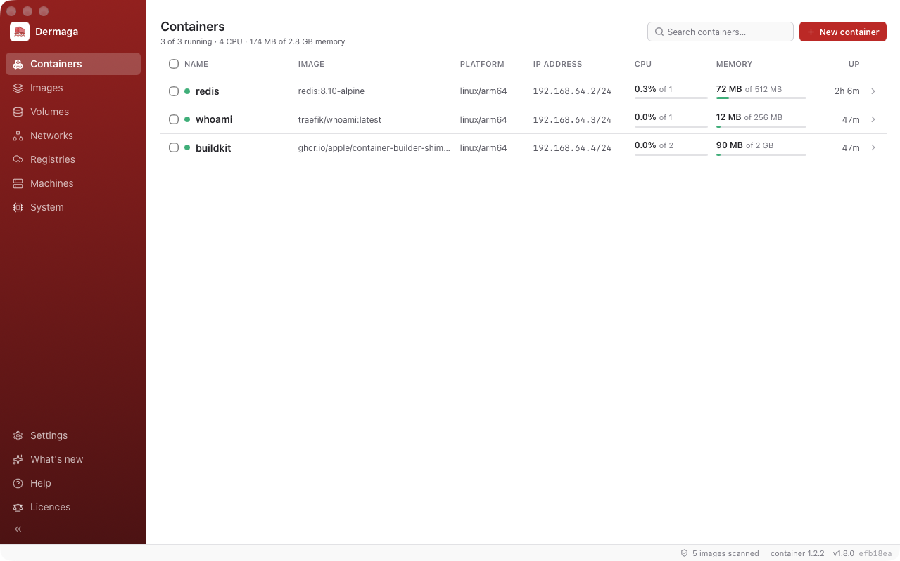

  

<h1 align="center">Dermaga</h1>

  A macOS app for Apple's <a href="https://github.com/apple/container"><code>container</code></a> runtime.

  
  
  
  

  

Dermaga is a lightweight alternative to Docker Desktop for Apple Silicon. It draws its window with
the Mac's own WebKit instead of shipping a browser engine, and drives Apple's `container` CLI rather
than replacing it — so everything you do here is visible to `container ls`, and everything you do in
a terminal shows up here within seconds.

It opens no ports, and there is no daemon by default: the agent belongs to the app and goes when it
does.

## Install

Download the DMG from **[Releases](https://github.com/ryanbekhen/dermaga/releases/latest)**, open it
and drag Dermaga to Applications. It is signed and notarized by Apple, so it opens the first time.

Requires macOS 26 on Apple Silicon. On first launch Dermaga offers to install Apple's `container`
CLI through Homebrew and a Linux kernel for it to run — both with a button, not a command.

## What it does

**Containers** — create, start, stop, restart, edit and remove, in bulk if you like. Live CPU and
memory, the whole network and mount configuration, and the last couple of minutes drawn as a chart —
already filled in when you open it, because the sampler runs from the moment the agent does. A real
shell in any running container, backed by a pty. Browse its filesystem and drag files in and out of
Finder. Mark one to come up when Dermaga does.

**Images** — build from a project folder, or from a Dockerfile you paste straight in. Pull, and
inspect the layers, history and config a container inherits. Save one out as an OCI archive or load
one back in. Sign in to a registry and push. Anything building or pulling shows in the title bar,
with a cancel beside it.

**Vulnerabilities** — every image is scanned in the background as it appears, so the answer is
usually waiting by the time you open one. The Packages tab lists what is inside the image with a
severity bar against each package; opening one shows the CVEs in it, and opening a CVE gives it a
window of its own. Runs entirely on your Mac.

**Volumes and networks** — see which containers mount a volume and where it lands inside each, and
look inside one even when nothing has it mounted. Open a network and see it drawn: every container
attached, with the address it holds there.

**Tunnels** — give a hostname on a domain you own to whatever is running here. Connect a Cloudflare
account once, then add a route: which of your domains, what to call it there, and what answers — a
container, one of the Linux machines, or this Mac itself, where your dev server probably already is.
A container listening on three ports gets three hostnames, not one and a guess. Dermaga makes the
tunnel, writes the DNS record and runs the connector, and the page draws the whole path each route
takes — hostname, connector, gateway, port, container — so a broken one shows you where. Recreate a
container and its routes follow it to the new address on their own. Nothing on this Mac listens for
the traffic.

**Machines** — create, boot, stop, resize and delete the Linux VMs containers run inside, each with
a shell of its own.

**Disk** — System reports what images, containers and volumes actually cost, and each is cleaned up
on its own. Apple's runtime unpacks every image into a filesystem of its own, so the figure there is
much larger than the download — and almost all of it is usually reclaimable.

**Live by default** — no refresh button anywhere. Changes made in a terminal appear within two
seconds; changes made here appear immediately. A container that stops without being asked to says
so, in the window and as a notification.

**⌘K** — search everything from the title bar: any container, image, volume, network, machine or
page, and the things you can do to them. Start, stop or restart a container, run one from an image,
attach or detach a network, or open the create, pull, build and load forms directly.

## Everyday use

| Shortcut | Action |
| -------- | ------ |
| `⌘K` | Search everything, and act on what you find |
| `Esc` | Clear the search |
| `⌘,` | Settings |

Preferences live in `~/.dermaga/config.json` as plain JSON, safe to edit by hand or keep in
dotfiles. What Dermaga works out for itself sits beside it in `~/.dermaga/dermaga.db`: scan results,
the template catalogue, an edit begun and not finished, which containers are marked to start, and the
tunnel routes.

## Privacy

Dermaga opens no ports. It runs Apple's CLI as you, and the window talks to its agent over a socket
in your own home directory. Nothing about your containers, images or scan results leaves this Mac —
what it fetches is its own updates, the CLI and scanner it installs through Homebrew, and the
template catalogue.

A tunnel is the one exception, and only the routes you add: a container you publish is reachable
from the internet until you remove that route. Cloudflare carries the traffic, so nothing here
starts listening for it. The API token you connect with is kept in this Mac's login keychain, never
in a file and never on a command line, and Disconnect removes it.

It asks before installing the `container` CLI, a Linux kernel, the optional background service, or
turning on notifications — in the app, rather than behind your back.

## Docs

| | |
| --- | --- |
| [Worth knowing](docs/worth-knowing.md) | the behaviour that surprises people, and why it works that way |
| [Vulnerability scanning](docs/scanning.md) | when images are scanned, what is cached, and why |
| [Architecture](docs/architecture.md) | the three layers, the packages, streaming, and the RPC surface |
| [Contributing](CONTRIBUTING.md) | setting up, running it locally, and the conventions |
| [Security](SECURITY.md) | reporting a vulnerability, and the boundaries worth testing |
| [Code of conduct](CODE_OF_CONDUCT.md) | what is expected of everyone here |

## Support

Something broken, or missing?
[Open an issue](https://github.com/ryanbekhen/dermaga/issues/new/choose) — the version from
**Settings → About** and what you were doing is usually enough to go on.

Found a security problem? Please report it
[privately](https://github.com/ryanbekhen/dermaga/security/advisories/new) rather than in an issue.

## License

[MIT](LICENSE) © Achmad Irianto Eka Putra
