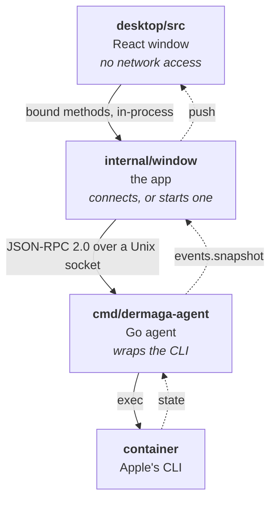
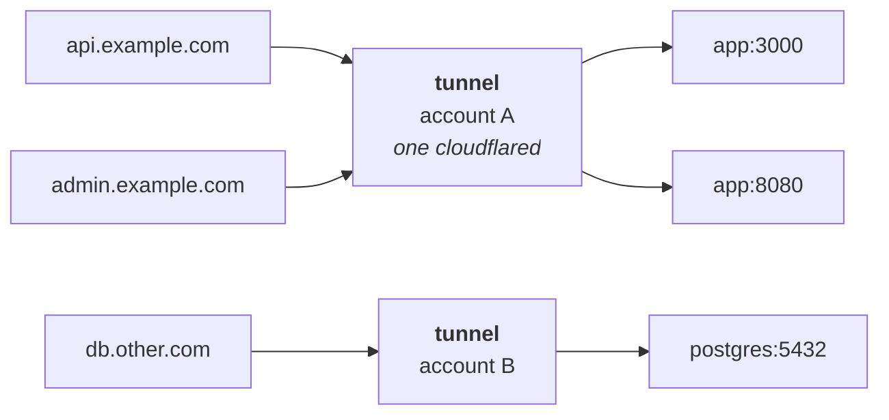
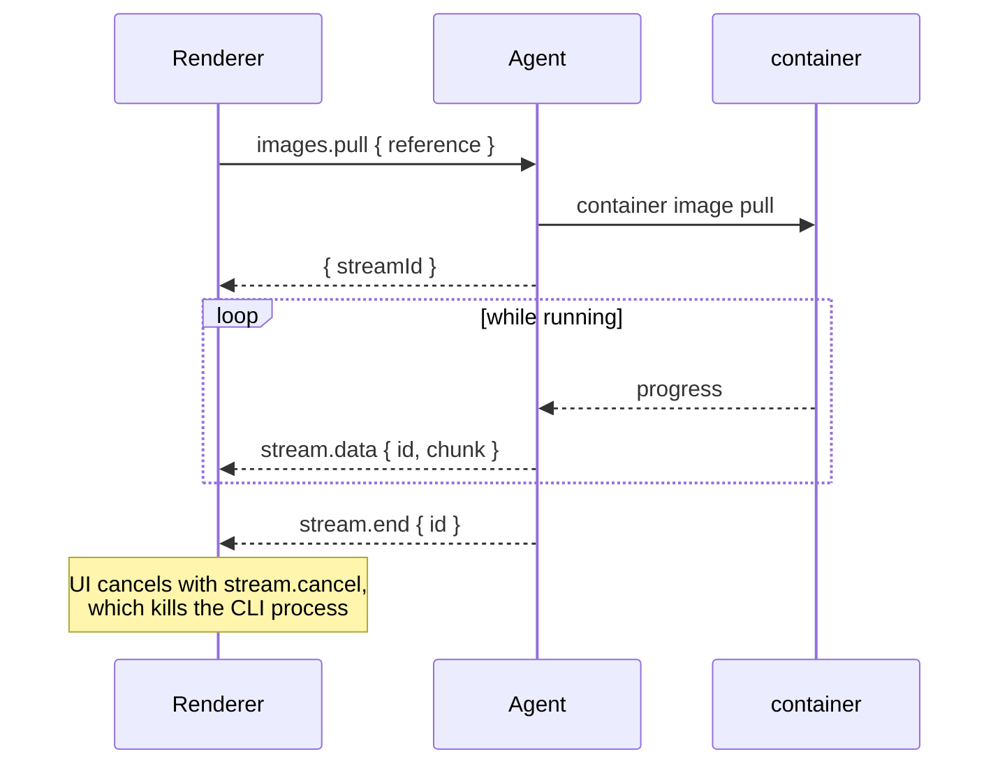

# Architecture

How Dermaga is put together: the three layers, the packages behind the
agent, how streaming works, and every method the window can call.

Three layers, each with one job. There is no HTTP server and no listening port — the agent speaks
JSON-RPC over a Unix socket at `~/.dermaga/agent.sock`, mode `0600`, and the app connects to it.

Usually the app starts that agent and takes it down again on quit. Switch the background service on
and launchd starts it instead, at login, and it carries on watching after the last window closes.
Either way there is exactly one: an agent that finds the socket answered stands down rather than
binding over it.



The agent holds no container state. Every call shells out; the only things it remembers are the last
stats sample, needed to turn cumulative CPU time into a percentage, the last snapshot, needed to tell
when something actually changed, and which containers you stopped on purpose, so that *unless
stopped* can mean what it says after a restart.

What Dermaga keeps *about* a container — today, whether it starts when Dermaga starts — is a record
in its own database, keyed by the container's name. It was a label on the container, which is the
better place for it in every way but one: a label can only be written by `container run`, so changing
it meant recreating the container, and ticking a box cost that container its filesystem. The record
is dropped when Dermaga deletes the container, and anything left over is swept up at startup, when
the whole list is in hand. Containers marked before 1.11.0 still carry the old `dermaga.autoboot`
label and it is still read; that fallback goes in 1.15.0.

### Go packages

```
cmd/dermaga-agent/   entrypoint: JSON-RPC on stdio
internal/cli/        runs `container`; nothing else builds a command for it
internal/oci/        reads the runtime's content store for what the CLI leaves out
internal/containers/ list, lifecycle, spec, live stats
internal/images/     list, inspect, build, pull, delete, prune
internal/files/      browse a container's filesystem, copy in and out
internal/registry/   registry logins, tag and push
internal/tunnels/    Cloudflare Tunnel: a container on a public hostname
internal/scanner/    Trivy: install, database, background scans, stored results
internal/volumes/    ·  internal/networks/  ·  internal/machines/
internal/system/     services and disk usage
internal/settings/   ~/.dermaga/config.json
internal/store/      the cache: scan results, catalogue, an edit not finished
internal/tasks/      what a command printed, kept after it finished
internal/templates/  starting points for the create form
internal/toolchain/  the CLI itself: installed version, install, upgrade
internal/terminal/   pty-backed shell sessions
internal/watcher/    one authoritative snapshot, pushed on change
internal/rpc/        framing, dispatch, streams
internal/agent/      wires domains to the RPC surface
internal/notify/     "something changed", so domains never import the watcher
```

A domain package never imports the watcher or the RPC layer; it takes a `notify.Notifier` instead.
`internal/agent` is the only seam where domains meet transport.

### Tunnels

A container has an address on this Mac and nothing beyond it. `internal/tunnels`
gives one a public hostname through Cloudflare Tunnel.

What somebody adds is a **route**: a hostname, and what answers behind it. That
is a kind, a name and a port — usually a container, but the Linux VMs have
addresses of their own, and so does macOS, where a dev server usually runs long
before it is in a container at all.

Tunnels are not something they make. A Cloudflare tunnel carries any number of
routes but belongs to exactly one account, so Dermaga keeps one per account and
creates it the first time a route needs it — which is why a container with six
ports is six routes rather than six tunnels, and why routes on domains in
different accounts land on different tunnels whether anybody asked or not.



Every tunnel is remotely managed (`config_src: "cloudflare"`), so its routing
lives in the account rather than in a file here. Cloudflare takes the ingress as
one document — there is no call that adds a single rule — so every change sends
all of that tunnel's routes, which also keeps the list here and the list there
from drifting apart.

A route records the container and port it was made for, and separately the
address that resolves to right now. Containers change address when they are
recreated, so the second is a fact with a shelf life: `Reconcile` runs from the
watcher's `OnChange`, re-points anything that moved, and re-sends the ingress.
The route follows its container without anybody coming back to it.

Two credentials, kept differently. The API token is the user's and can change
their DNS, so it goes in the login keychain, written through `security -i` so it
never appears in `ps`, and with `-T /usr/bin/security` so reading it does not
raise a permission dialog every time. Each tunnel's run token is derivable from
it, so it is fetched when a connector starts rather than stored at all — and it
reaches `cloudflared` through `TUNNEL_TOKEN` rather than a command line.

Disconnecting takes the routes down first and forgets the token second. The
order is the point: the token is the only thing that can reach Cloudflare, so
forgetting it first would strand every hostname, DNS record and tunnel it made —
alive in the account, with nothing left here able to remove them.

Connectors are Dermaga's children: `Restore` brings back one per tunnel that has
routes — at startup, and again when a token is connected — and `Close` takes
them all down with the agent. Stopping one is a
`SIGTERM` with a kill behind it, so the edge learns the connector has left
instead of sending to a socket that is not there. A tunnel whose last route is
removed is deleted with it.

### Streams

Logs, pulls, machine creation and terminals are long-running, so they are streams rather than calls.



### RPC surface

| Method                                                                                | Notes                                    |
| ------------------------------------------------------------------------------------- | ---------------------------------------- |
| `system.status` `system.start` `system.stop`                                          | Services, CLI version, kernel opt-in     |
| `system.diskUsage` `system.prune` `system.logs`                                       | Disk usage and reclaiming                |
| `settings.get` `settings.save`                                                        | Preferences on disk                      |
| `containers.list/get/spec/start/stop/remove/update`                                   | Lifecycle                                |
| `images.list/inspect/delete/prune`                                                    | Images                                   |
| `scanner.status` `scanner.scan` `scanner.report` `scanner.reports` `scanner.clear`    | Vulnerabilities, pushed as they finish   |
| `files.list` `files.copyIn` `files.copyOut`                                           | A container's filesystem                 |
| `registry.list/login/logout` `images.tag` `images.push`                               | Registries                               |
| `containers.exited`                                                                   | Pushed when a container stops by itself  |
| `system.kernelConfigured` `system.installKernel`                                      | The Linux kernel containers run on       |
| `images.builderStatus` `images.startBuilder`                                          | The buildkit container builds run in     |
| `volumes.*` `networks.*`                                                              | List, create, delete                     |
| `tunnels.status/list/connect/disconnect/zones/targets`                                | Cloudflare, and what a route could point at |
| `tunnels.addRoute/removeRoute` `tunnels.start/stop` `tunnels.install`                 | Routes and connectors; install is a stream |
| `containers.run`                                                                      | Create and wait, for helper containers   |
| `machines.list/get/start/stop/delete/setDefault/configure`                            | Machine lifecycle                        |
| `containers.history` `containers.hasShell` `containers.kill`                          | Usage over the last minutes, and the abrupt stop |
| `containers.recreate` `containers.setAutoBoot`                                        | Run again on what the tag means now; start with Dermaga |
| `containers.pendingEdit` `containers.discardEdit`                                     | An edit begun and not finished |
| `images.save` `images.load`                                                           | An image out to an OCI archive, and back |
| `machines.logs`                                                                       | A machine's own log, boot or stdio |
| `scanner.result` `scanner.dismiss`                                                    | One report, and clearing the badge |
| `system.dns`                                                                          | The runtime's local DNS domains |
| `toolchain.status` `toolchain.install` `toolchain.update`                             | The CLI itself, through Homebrew |
| `templates.list` `templates.refresh`                                                  | Starting points for the create form |
| `tasks.list` `tasks.record` `tasks.forget`                                            | What a finished command printed |
| `volumes.owner` `volumes.setOwner` `volumes.tidy`                                     | Who a volume belongs to, and clearing up |
| `app.info`                                                                            | Version, commit and build date |
| `events.subscribe`                                                                    | Pushes `events.snapshot` on every change |
| `containers.create` `containers.logs` `images.pull` `images.build` `machines.create`  | Streams                                  |
| `terminal.open/input/resize` `stream.cancel`                                          | pty sessions, base64 payloads            |
