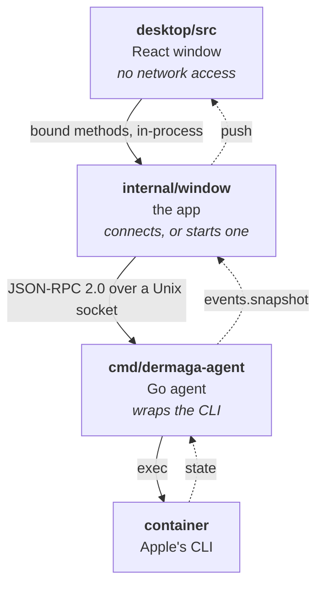
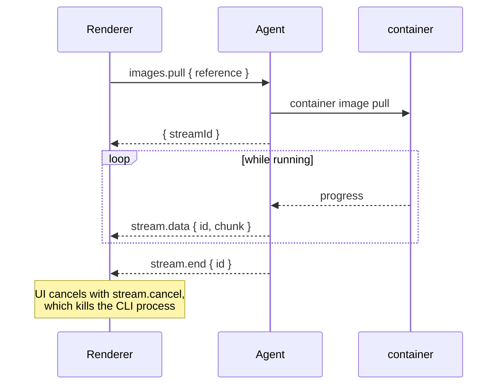

# Architecture

How Dermaga is put together: the three layers, the packages behind the
agent, how streaming works, and every method the window can call.

Three layers, each with one job. There is no HTTP server and no listening port — the agent speaks
JSON-RPC over a Unix socket at `~/.dermaga/agent.sock`, mode `0600`, and the app connects to it.

Usually the app starts that agent and takes it down again on quit. Switch the background service on
and launchd starts it instead, at login, and it carries on watching after the last window closes.
Either way there is exactly one: an agent that finds the socket answered stands down rather than
binding over it.



The agent holds no container state. Every call shells out; the only things it remembers are the last
stats sample, needed to turn cumulative CPU time into a percentage, the last snapshot, needed to tell
when something actually changed, and which containers you stopped on purpose, so that *unless
stopped* can mean what it says after a restart.

Restart policies live on the containers themselves, as a `dermaga.restart` label. Nothing in Dermaga
has to be kept in step with what the CLI already knows.

### Go packages

```
cmd/dermaga-agent/   entrypoint: JSON-RPC on stdio
internal/cli/        runs `container`; the only package that touches os/exec
internal/containers/ list, lifecycle, spec, live stats
internal/images/     list, inspect, build, pull, delete, prune
internal/files/      browse a container's filesystem, copy in and out
internal/registry/   registry logins, tag and push
internal/scanner/    Trivy: install, database, background scans, stored results
internal/volumes/    ·  internal/networks/  ·  internal/machines/
internal/system/     services and disk usage
internal/settings/   ~/.dermaga/config.json
internal/terminal/   pty-backed shell sessions
internal/watcher/    one authoritative snapshot, pushed on change
internal/rpc/        framing, dispatch, streams
internal/agent/      wires domains to the RPC surface
internal/notify/     "something changed", so domains never import the watcher
```

A domain package never imports the watcher or the RPC layer; it takes a `notify.Notifier` instead.
`internal/agent` is the only seam where domains meet transport.

### Streams

Logs, pulls, machine creation and terminals are long-running, so they are streams rather than calls.



### RPC surface

| Method                                                                                | Notes                                    |
| ------------------------------------------------------------------------------------- | ---------------------------------------- |
| `system.status` `system.start` `system.stop`                                          | Services, CLI version, kernel opt-in     |
| `system.diskUsage` `system.prune` `system.logs`                                       | Disk usage and reclaiming                |
| `settings.get` `settings.save`                                                        | Preferences on disk                      |
| `containers.list/get/spec/start/stop/remove/update`                                   | Lifecycle                                |
| `images.list/inspect/delete/prune`                                                    | Images                                   |
| `scanner.status` `scanner.scan` `scanner.report` `scanner.reports` `scanner.clear`    | Vulnerabilities, pushed as they finish   |
| `files.list` `files.copyIn` `files.copyOut`                                           | A container's filesystem                 |
| `registry.list/login/logout` `images.tag` `images.push`                               | Registries                               |
| `containers.exited`                                                                   | Pushed when a container stops by itself  |
| `system.kernelConfigured` `system.installKernel`                                      | The Linux kernel containers run on       |
| `images.builderStatus` `images.startBuilder`                                          | The buildkit container builds run in     |
| `volumes.*` `networks.*`                                                              | List, create, delete                     |
| `containers.run`                                                                      | Create and wait, for helper containers   |
| `machines.list/get/start/stop/delete/setDefault/configure`                            | Machine lifecycle                        |
| `events.subscribe`                                                                    | Pushes `events.snapshot` on every change |
| `containers.create` `containers.logs` `images.pull` `images.build` `machines.create`  | Streams                                  |
| `terminal.open/input/resize` `stream.cancel`                                          | pty sessions, base64 payloads            |
